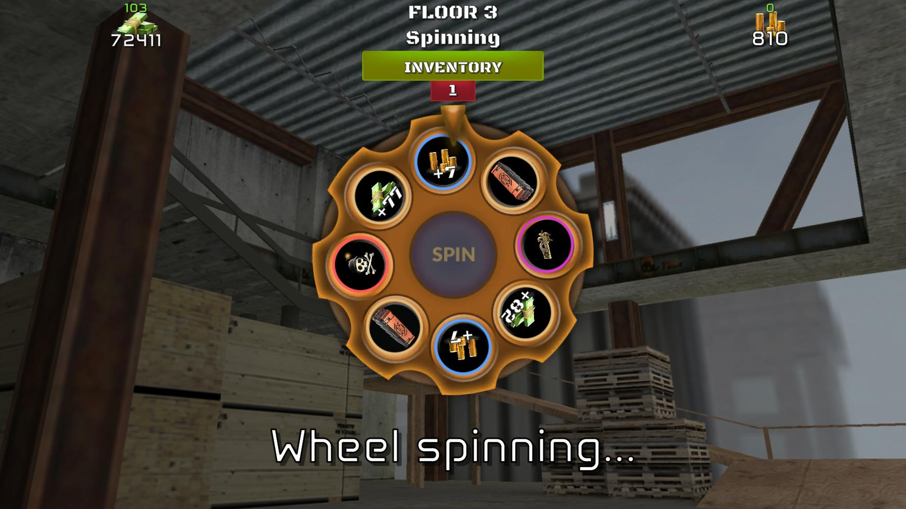

# Critical Shot

Critical Shot is a Unity demo project built around a deterministic roulette-climb game loop. The player advances through zones, spins a procedurally generated wheel, avoids bombs, accumulates rewards during the run, and decides when to cash out.

## Core loop
1. Start a run and pay any configured buy-in.
2. Enter the current zone and build the matching roulette wheel.
3. Spin a preselected deterministic result.
4. If the spin lands on a reward, bank it into the run ledger and advance.
5. If the spin lands on a bomb, the run busts unless continue is available.
6. Cash out on allowed zones to move pending rewards into saved profile data.

## Technical overview
- The project is bootstrapped through `Assets/_Game/Scenes/Loader.unity`. The persistent `App` object initializes profile, sound, scene, and game managers, then loads the `Game` scene.
- Gameplay and presentation are driven by ScriptableObject assets under `Assets/_Game/Scriptables`.
- `AppConfig` wires the active game config and startup scene, `GameConfig` defines run rules, and `RouletteConfig` defines wheel assets, reward catalog, and deterministic seeding.
- The default configuration uses deterministic seed `1337`, buy-in `0`, continue cost `100`, safe zones every `5` floors, and super zones every `30` floors.
- Player progression is stored locally with `PlayerPrefs` under the key `CriticalShot.SaveData`.
- UI is built with UGUI/TextMeshPro, and animation-heavy flows such as loading transitions and roulette spins use DOTween.

## Project layout
- `Assets/_Game/Scenes`: loader and gameplay scenes.
- `Assets/_Game/Scripts/Core`: app bootstrap and shared runtime dependencies.
- `Assets/_Game/Scripts/Game`: gameplay managers, roulette resolution, rewards, and UI.
- `Assets/_Game/Scriptables`: gameplay tuning, wheel definitions, rewards, sounds, and text config assets.

## Running the project
1. Open the project in Unity `2021.3.45f2`.
2. Press Play from the editor. The project includes editor scene flow logic that routes Play Mode through `Loader.unity`.
3. Tweak gameplay values from the assets in `Assets/_Game/Scriptables` if you want to change balance or presentation.

## Environment
- Unity `2021.3.45f2`
